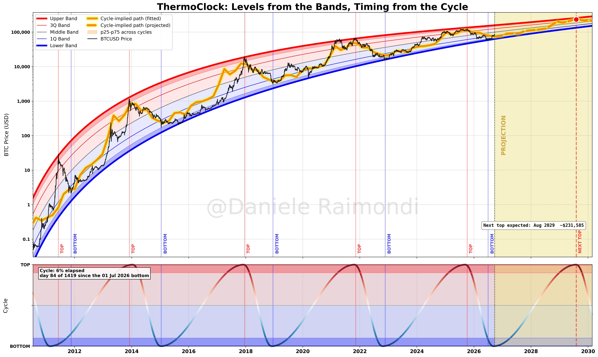
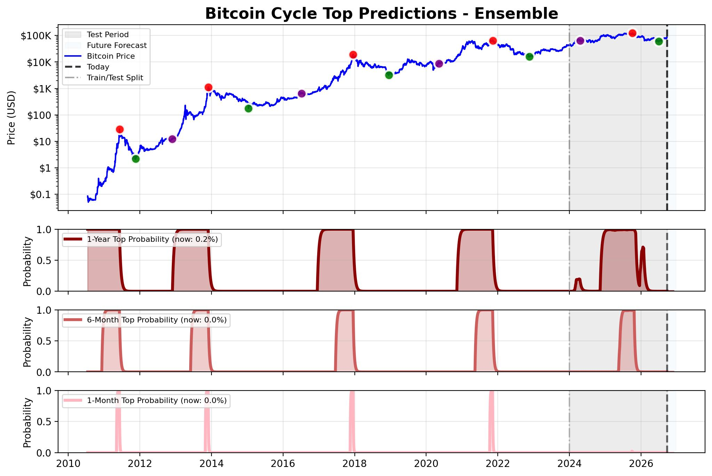
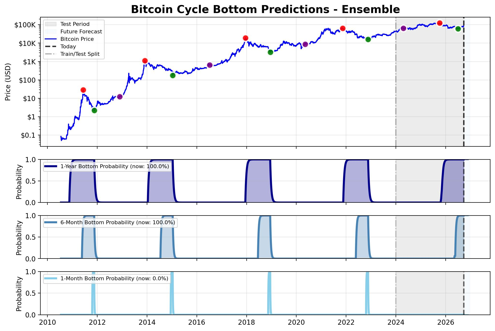

# **Bitcoin DataScience ₿** 📈

A collection of quantitative models for Bitcoin: long-run price corridors, halving-cycle structure,
machine-learning forecasts of cycle tops and bottoms, on-chain valuation indicators, and the macro
and market-structure studies that sit around them. Every chart below is regenerated from live data.

> **Data**: price and on-chain metrics from [CoinMetrics Community Network Data](https://coinmetrics.io/community-network-data/),
> topped up with Yahoo Finance daily closes. Macro series from FRED. See [Data & Attribution](#data--attribution).

---

## 1. Price Models

Where price sits against its own long-run trend, and how wide the corridor around it should be.

### ThermoClock 🕰️

The ThermoModel's bands (below) answer *how high and how low* but say nothing about *when*; the
cycle analysis answers the opposite. Combined, they give a dated price path. A ThermoClock - the
same clock the cycle analysis draws, with every cycle the same length (1,419 days, fitted by least
squares on the tops and bottoms together) and bottoms a quarter of a cycle after each top, since
the cycle is asymmetric, roughly a year down and three years back up - is mapped against where in
the corridor price historically sat at each point of the cycle, then projected onto the extended
bands. The per-cycle profiles correlate 0.55–0.78 and agree tightly at the extremes (interquartile
spread of 5–11 points) but less so late in the climb (up to 45 points), so the dated extremes are
worth more than the path between them.

### ThermoModel 🌡️

Predicts and analyses Bitcoin price movements by combining cubic and logarithmic regression
models. Dynamic price bands and an oscillator identify potential buy and sell zones, giving a
single view of where price stands relative to its thermodynamic corridor.

### ThermoModel v2 🌡️📉

A rebuild of the ThermoModel that accounts for diminishing returns. The original fits a cubic
polynomial in day index with fixed log-space offsets: the cubic extrapolates explosively upward
(the opposite of diminishing returns) and a fixed offset keeps a constant band width forever.
The trend is a log-log fit whose exponent eases off with time: refitted in real time, a plain
power law's fixed exponent kept falling (6.8, 5.9, 5.8, 5.6 at the last four bottoms) and
overshot every next bottom, which the concave trend corrects. Measured against it, cycle tops came
in at 18.4x, 9.7x, 5.7x, 3.0x, 1.4x and the deepest close of each cycle at 0.32x, 0.33x, 0.42x,
0.47x, 0.55x, so both offsets move with the cycle: the upper one decays, fitted on the five tops,
the lower one rises, fitted by quantile regression on the daily closes so that **99.5% of the
history closes above it** (the old flat band, the mean of the five bottoms, was cut through on 15%
of days, the deepest 36% below). Validated leave-future-out on out-of-sample top prediction, the
median absolute error drops to **13% from 83%** (22% on a fixed-exponent trend).

### LogTimeLogPrice 🪜

Analyses Bitcoin's price growth over time on a log-log graph. Beyond plotting support and
resistance lines via Ordinary Least Squares regression, it adds an oscillator subplot that reads
market sentiment from deviations against those trend lines.

### AritmTimeLogPrice ⚙️

An exponential transformation of the time dimension in the LogTimeLogPrice model, applied so that
its results become directly comparable with the ThermoModel's.

### ThermoLogTimeLogPrice 💪🏻

A straightforward ensemble of the ThermoModel and LogTimeLogPrice: averaging the predicted upper
and lower bands of both produces a more robust corridor than either alone.

### Slopes Growth Model 🪴

Analyses Bitcoin's diminishing returns by connecting historical peaks and bottoms with regression
lines, then forecasting future cycles using exponential decay convergence. As Bitcoin matures,
growth rates decline and converge toward a stable target, creating a narrowing price corridor that
reflects the transition from explosive early growth to more mature market behaviour.

### Metcalfe's Law 🕸️

Quantifies Bitcoin's fundamental value from network activity to identify overvaluation and
undervaluation periods, turning network-effects theory into a data-driven indicator.

### 209-Week SMA 🚂

Bitcoin's price against its 209-week Simple Moving Average. The 209-week window is the halving
cycle itself — four years, roughly 209 weeks — and this average has historically acted as a
durable support level.

---

## 2. Cycles

The four-year halving rhythm, and where in it we currently stand.

### Cycles 🧲

Analyses and visualises the cyclical patterns in Bitcoin's price, with particular focus on the
four-year cyclicity dictated by halving events, highlighting how those milestones shape the
broader cyclical behaviour of the market.

### CyclesNorm 🔄

Normalises price data from the 2016, 2020 and 2024 halving cycles - plus the nascent, still-open
2028 cycle - so they can be compared directly, identifying key inflection points and projecting
the timing of potential tops and bottoms. Colour-coded background shading marks the market
phases, with a sinusoidal overlay for the underlying cyclical structure.

### Epochs Growth 📆

Bitcoin's price growth measured from each halving event, which makes the diminishing-returns
effect legible across epochs.

### MVRV 🔋

Explores the relationship between Bitcoin's market and realized values to pinpoint tops and
bottoms. An oscillator marks overbought and oversold zones, highlighting the two-peak structure of
each cycle, where the second peak typically marks the all-time high.

---

## 3. Machine Learning

Supervised forecasts of cycle timing, validated on a window the models never saw.

### Cycle Top Forecast 🤖🔺

A gradient-boosting ensemble that answers *when*, not *how high*: for every day it estimates the
probability that a cycle top falls within the next month, six months or year. It learns from the
run-up to the 2011, 2013, 2017 and 2021 tops, using price technicals, halving-epoch phase, market
and macro data (each macro figure dated to its release, not to the month it describes) and the
cycle clock. Everything from 2024 on is held out, including whatever is fitted to the extremes: the
clock is refitted on the pre-2024 tops and bottoms only, and an extreme counts in any feature only
90 days after it happened. On that untouched window the 1-year and 6-month signals both fired ahead
of the October 2025 top but pointed about 70 days past it; the 1-month signal never fired.

### Cycle Bottom Forecast 🤖🔻

The same pipeline, trained on the run-down into the 2011, 2015, 2018 and 2022 bottoms. Out of
sample it is the weaker of the two: the 1-year and 6-month signals pointed to December 2026, about
160 days after the July 2026 low, and the 1-month signal never fired. With four training cycles per
side, read both as a structured second opinion on cycle timing rather than a calibrated date.

---

## 4. Valuation & Risk

On-chain and price-derived indicators for cycle position. The composite comes first; the
components that feed the same question follow.

### Cycle Risk Model 🎚️

A single composite 0–100 score answering "where are we in the cycle?": 0 = cycle lows, 100 = cycle
highs. It blends three indicators, each ranked against its own trailing 4-year distribution: the
deviation of price from its expanding power-law trend (weight 0.6), the MVRV ratio (0.2) and the
2-Year MA Multiplier (0.2). Weights were selected by backtest rather than by taste, and are
renormalized over whatever components are available so the score survives the on-chain feed lagging.

Validated on forward returns by risk bucket: readings in the 80–100 bucket have historically been
followed by *negative* median returns at every horizon (−14.5% at 90d, −29.1% at 365d), while low
readings precede strong gains. The edge is concentrated at the extremes and grows with the horizon
— this is a cycle-position tool, not a short-term timing signal. A conditional, empirical
projection (every past episode that started at today's risk level *and* today's 30-day direction
of travel) extends it six months forward; with only a handful of overlapping episodes from three
completed cycles, read it as "what happened the last few times", not as a calibrated probability.

### MVRV Z-Score 🧮

Measures the gap between Bitcoin's market cap and its realized cap (the aggregate cost basis of
all coins), normalized by the historical standard deviation of market cap. Plots the Realized
Price alongside BTC price, and has historically flagged euphoric tops (Z-Score > 7) and
capitulation bottoms (Z-Score < 0).

### NUPL 😨🤑

Net Unrealized Profit/Loss expresses the same market cap vs. realized cap gap as a fraction of
market cap, split into five classic sentiment zones from Capitulation to Euphoria/Greed — a quick
read on how much of the market is sitting on unrealized gains or losses.

### Puell Multiple ⛏️💵

Compares the daily USD value of newly issued Bitcoin against its own 365-day moving average.
Spikes above 4x have historically coincided with cycle tops (miners cashing out into euphoric
prices), while drops below 0.5x have marked cycle bottoms (depressed miner revenue).

### Pi Cycle Top Indicator 🥧

Watches for the 111-day moving average crossing above 2x the 350-day moving average. Every time
this crossover has occurred, Bitcoin's price has been within days of the cycle's eventual top.

### Golden Ratio Multiplier 🌀

Tracks Bitcoin's 350-day moving average and its Fibonacci multiples (1.6x, 2x, 3x, 5x, 8x, 13x,
21x). Each band has historically lined up with a resistance level reached during past bull-market
advances.

### 2-Year MA Multiplier 📏

Plots Bitcoin's price against its own 730-day (2-year) moving average and 5x that average. The
2-year MA has historically acted as a strong long-term accumulation zone, while 5x the 2-year MA
has capped the blow-off top of every cycle to date.

### Hash Ribbons ⛏️📶

Compares the 30-day and 60-day moving averages of Bitcoin's hashrate to flag miner capitulation
(30-day average below the 60-day) and its recovery. Historically, the recovery point has marked
strong accumulation zones. Short whipsaws around the crossing point are filtered out so only
sustained capitulations are flagged.

---

## 5. Supply & Demand

### BTC vs Supply 💭

Explores the growth correlation between Bitcoin's supply curve and its price history, to see how
programmed scarcity influences value over time.

### BTC vs M2 🕯

Compares Bitcoin's supply dynamics with the M2 money supply to highlight their fundamental
differences in growth patterns, control mechanisms and responses to economic conditions —
Bitcoin's case as a store of value against an inflationary monetary system.

### Available Supply 💰

Estimates the percentage of Bitcoin lost over time and forecasts the future available supply,
accounting for both the 21M cap and a decaying loss rate. The result is a view of the effective
supply actually in circulation, and of how diminishing float could affect price over the long term.

### Demand 🙋🏽‍♂️

Analyses on-chain activity — active addresses and total transaction count — alongside price, using
both as proxies for Bitcoin demand and for the growth of real user engagement on the network.

---

## 6. Macro

### Economics 🪙

Places the main U.S. macroeconomic indicators and Bitcoin's price on a single chart, making their
interactions and influences easier to read.

### BTC vs Liquidity 🤑

The relationship between Bitcoin's price and global money supply: liquidity expansion shows a
strong correlation with Bitcoin's price movements.

### DXY 💲

Analyses the relationship between Bitcoin and the US Dollar Index over time, on the hypothesis
that a USD-quoted BTC is materially affected by DXY. LOESS smoothing visualises the trends and
their derivatives: during BTC depression phases DXY is strong and rising, while BTC advances
coincide with a declining DXY, and the in-between phases show a stable DXY.

---

## 7. Market Structure

### Cohorts 🐋

Visualises Bitcoin's distribution across address cohorts over time, applying LOESS smoothing to
correlate balance ranges with market behaviour. Comparing how different holder types react to
market moves reveals patterns of accumulation and distribution.

### ETF Flows 🏦

Collects Bitcoin and Ethereum spot-ETF flow data, joins it to prices, and visualises the flows
with trend analysis.

### Miners ⛏️

Identifies hedge and diversification opportunities in the crypto sector by studying correlations
between Bitcoin and the major listed mining companies, alongside their BTC holdings and short
interest data.

---

## 8. Sentiment & Events

### Google Trends 🔍

Explores the correlation between Google search interest for specific cryptocurrencies and their
price fluctuations, on the hypothesis that search trends proxy sentiment and may lead market
behaviour.

### BTC vs US Elections 🇺🇸

Examines the correlation between Bitcoin's price and Donald Trump's probability of winning the
2024 U.S. Presidential Election, on the hypothesis that the prospect of a Bitcoin-friendly
president moves the asset. Election probabilities are sourced from Polymarket.

### Bitcoin and Political Events 🗳️

Broadens the previous study beyond U.S. elections to regulatory announcements, policy shifts and
major political transitions worldwide, using time-series and correlation analysis to find patterns
in how Bitcoin reacts to the geopolitical landscape.

---

## Data & Attribution

| Source | Used for |
| --- | --- |
| [CoinMetrics Community Network Data](https://coinmetrics.io/community-network-data/) | BTC price and on-chain metrics |
| [Yahoo Finance](https://finance.yahoo.com/) | Daily closes, equities, index data |
| [FRED](https://fred.stlouisfed.org/) (St. Louis Fed) | Macroeconomic series |
| [Polymarket](https://polymarket.com/) | 2024 US election probabilities |
| [Google Trends](https://trends.google.com/) | Search interest |

Several indicators implemented here are established, publicly documented concepts created by
others; the implementations are mine, the ideas are theirs:

- **Puell Multiple** — David Puell
- **MVRV / MVRV Z-Score** — Murad Mahmudov & David Puell
- **NUPL** — Tuur Demeester & Adamant Research
- **Pi Cycle Top Indicator**, **Golden Ratio Multiplier**, **2-Year MA Multiplier** — Philip Swift
- **Hash Ribbons** — Charles Edwards, Capriole Investments
- **Metcalfe's Law** — Robert Metcalfe

On-chain metrics published by CoinMetrics lag live price by weeks to months. Charts built on
on-chain fields therefore end at the last genuine observation, while the price line runs to today.

---

## Notes

⭐ If you find this useful, star the repository. Feedback and corrections are welcome via issues.

**Disclaimer**: the content of this repository is for informational and educational purposes only
and is not financial advice. Always do your own research and consult a professional before making
any investment decision. 🚫💰📚

**Copyright** © Daniele Raimondi. All rights reserved. The charts and write-ups are published
here for viewing; no licence to use, copy, modify or redistribute the underlying code is granted.
