# **Bitcoin DataScience ₿** 📈

Welcome to `bitcoin_datascience`, your destination for exploring and modeling Bitcoin prices through the lens of data science! This repository is dedicated to providing insightful analysis, predictive models, and cutting-edge research on the ever-dynamic world of Bitcoin. Whether you're a seasoned trader, a crypto enthusiast, or a data science lover, you'll find valuable resources to deepen your understanding of Bitcoin's market movements and its underlying trends.

## What You'll Find Here 🧐

- **Jupyter Notebooks**: Dive into interactive analyses, from basic explorations to advanced predictive modeling, all designed to uncover hidden patterns and forecast future prices.
- **Python Code**: Access well-documented and reusable Python scripts and modules that power my analyses, making it easy for you to integrate and adapt them into your own projects.
- **Data Visualization**: Experience compelling visual narratives that bring data to life, offering clear and intuitive insights into Bitcoin's price behavior.
- **Machine Learning Models**: Explore sophisticated machine learning approaches to price prediction, from time series analysis to statistical modelling, all tailored towards the cryptocurrency market.

### Data are fetched at:

> BTC PRICE AND ON-CHAIN DATA: https://coinmetrics.io/community-network-data/

## List of projects: 📝

## 1.Growth:

#### ThermoModel 🌡️ 
The ThermoModel project aims to predict and analyze Bitcoin price movements by integrating cubic and logarithmic regression models. 
Through the creation of dynamic price bands and oscillators, it seeks to identify potential buy and sell zones, providing a comprehensive tool for understanding market trends and making informed investment decisions in the cryptocurrency space.

#### LogTimeLogPrice 🪜 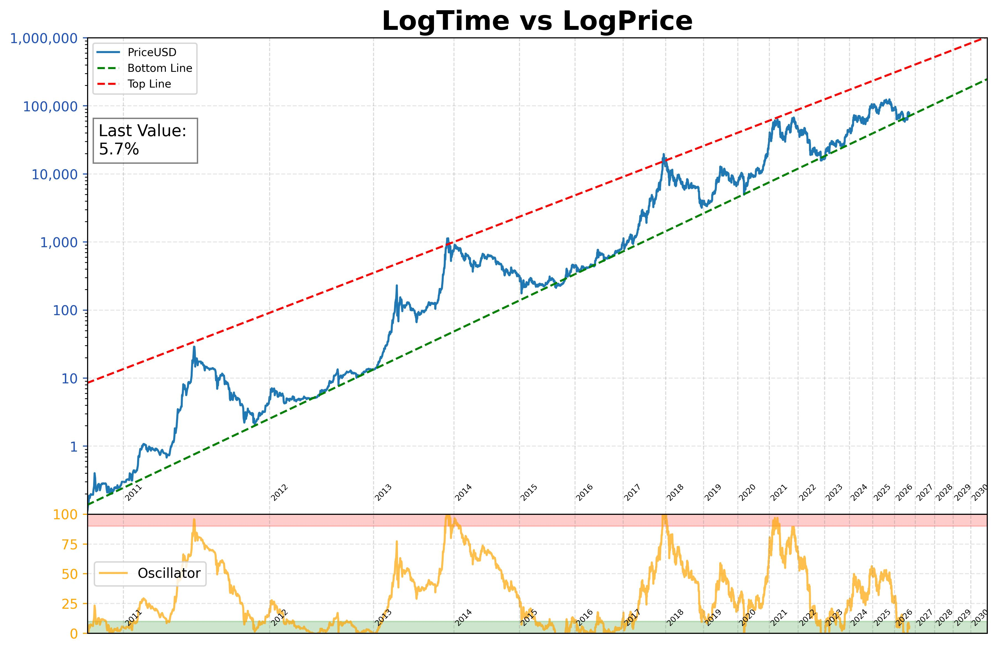
This study is a powerful tool designed to analyze Bitcoin's price growth over time using a log-log graph. In addition to plotting support and resistance lines using Ordinary Least Squares (OLS) regression, this function introduces an oscillator subplot. This oscillator provides insights into market sentiment, aiding investors in identifying potential buy and sell signals based on deviations from the trend lines.

#### AritmTimeLogPrice ⚙️ 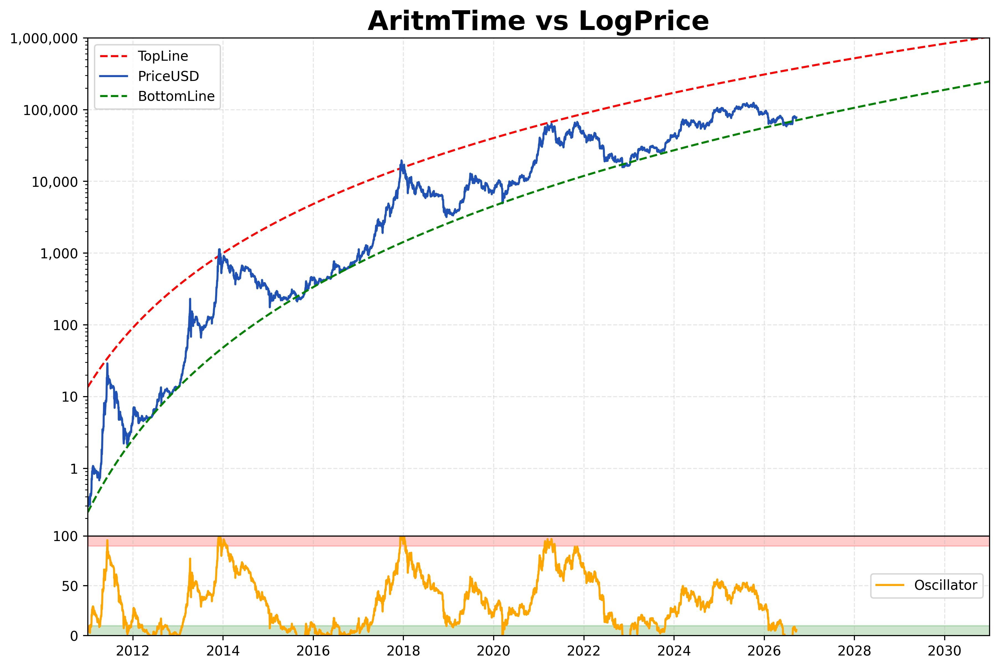
This section demonstrates an exponential transformation of the time dimension in the LogTimeLogPrice model. This transformation is applied to ensure the results are comparable with those of the ThermoModel.

#### ThermoLogTimeLogPrice 💪🏻 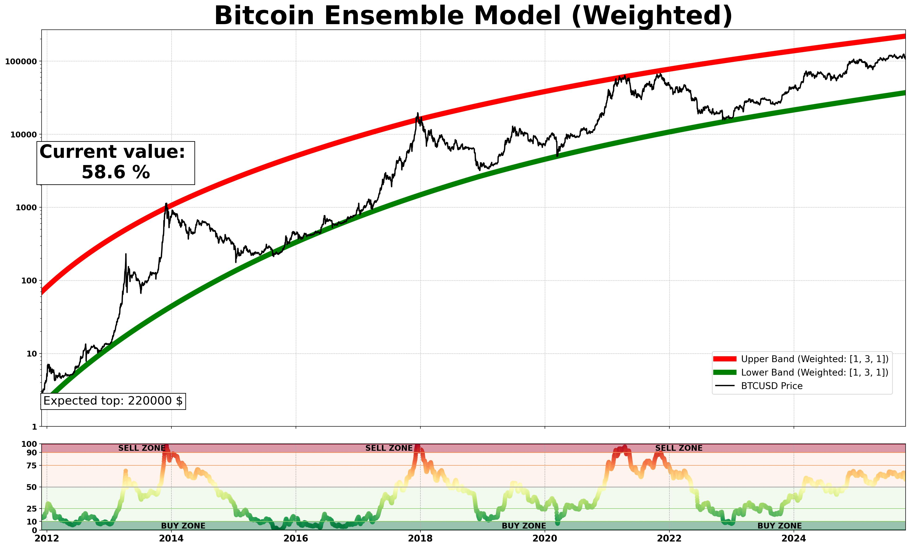
Here I present a straightforward ensemble of the ThermoModel and LogTimeLogPrice models. The purpose is to average the predicted upper and lower bands from both models, providing a more robust forecast.

#### Slopes Growth Model 🪴 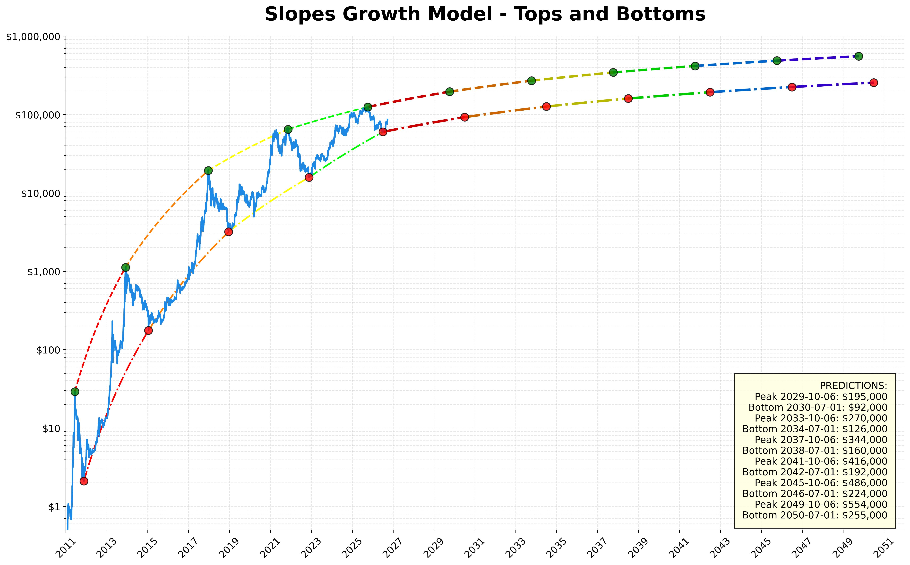
This model analyzes Bitcoin's diminishing returns by connecting historical peaks and bottoms with regression lines, then forecasting future cycles using exponential decay convergence. As Bitcoin matures, growth rates naturally decline and converge toward a stable target, creating a narrowing price corridor that reflects the transition from explosive early growth to more mature market behavior over time.

#### BTC vs Supply 💭 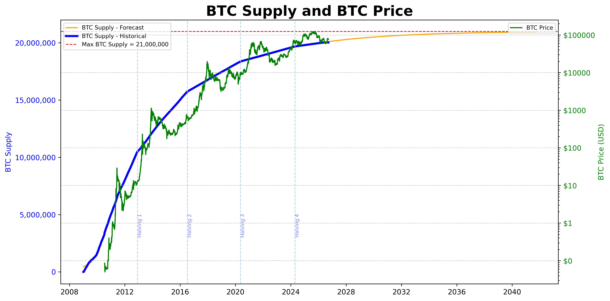
This analysis explores the growth correlation between Bitcoin's supply curve and its price history, to gain insights into how Bitcoin's programmed scarcity might influence its value over time.

#### BTC SMA 🚂 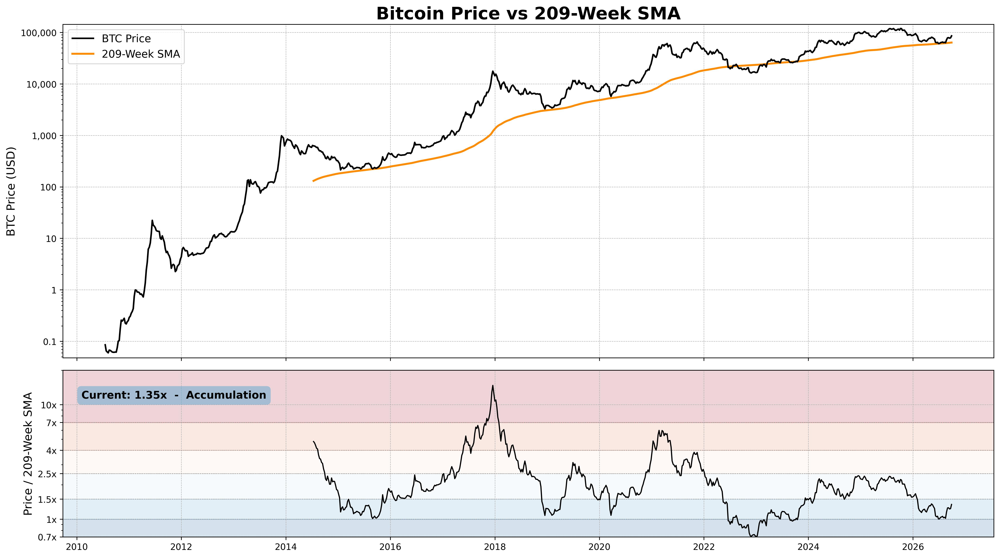
In this visualization, we display the Bitcoin price movement in comparison to its Simple Moving Average (SMA) calculated over 209 weeks. The reason for choosing 209 weeks is linked to the Bitcoin halving cycle, which occurs every 4 years, approximately equivalent to 209 weeks. It has always been a great support of Bitcoin's prices.

#### ThermoModel v2 🌡️📉 
A rebuild of the ThermoModel that accounts for diminishing returns. The original fits a cubic polynomial in day index with fixed log-space offsets: the cubic extrapolates explosively upward (the opposite of diminishing returns) and a fixed offset keeps a constant band width forever. Measured against a power-law trend, cycle tops came in at 15.4x, 11.1x, 6.4x, 2.9x, 1.2x while bottoms stayed flat at ~0.5x, so v2 models the two bands differently: a linearly decaying upper offset and a constant lower one. Validated leave-future-out on out-of-sample top prediction, the median absolute error drops to **21% from 83%** 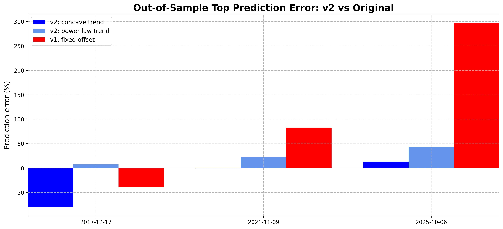

#### Cycle Clock 🕰️ 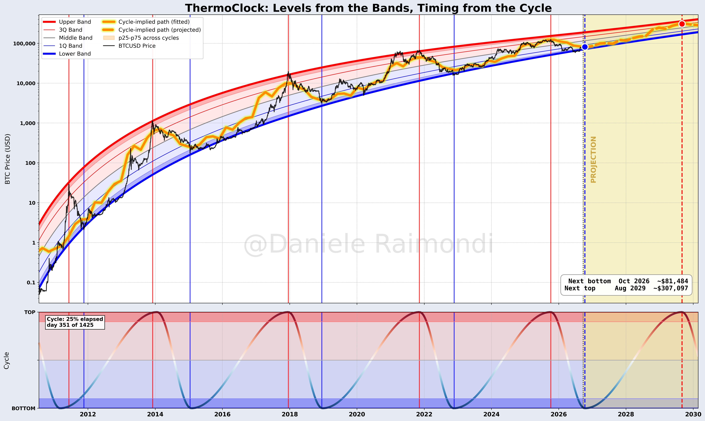
The bands answer *how high and how low* but say nothing about *when*; the cycle analysis answers the opposite. Combined, they give a dated price path. A cycle clock (median top-to-top interval, with bottoms landing at phase 0.26 rather than 0.5 — the cycle is asymmetric, roughly a year down and three years back up) is mapped against where in the corridor price historically sat at each point of the cycle, then projected onto the extended bands. The per-cycle profiles correlate 0.53-0.98 and agree tightly at the extremes (interquartile spread of 11-15 points) but diverge badly mid-ascent (past 80 points), so the dated extremes are worth more than the path between them 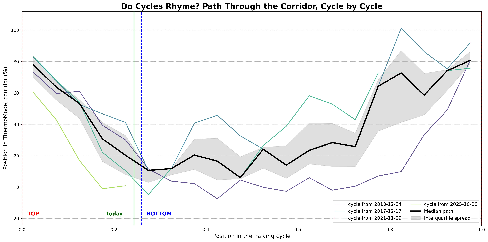

#### Metcalfe Law 🕸️ 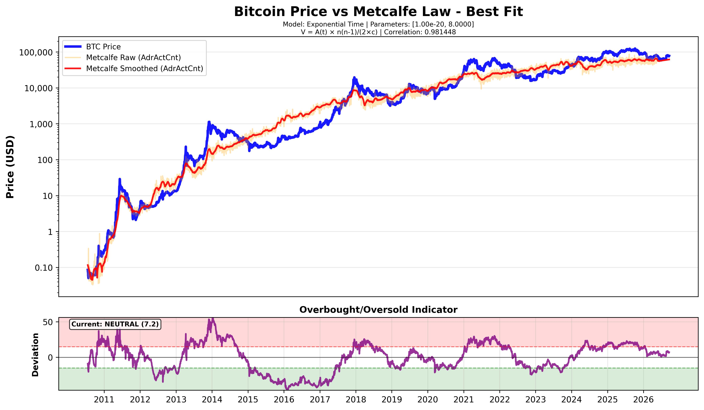
Quantify Bitcoin's fundamental value using network activity to identify overvaluation/undervaluation periods and develop a data-driven trading indicator based on network effects theory.

## 2.Cycles:

#### Cycles 🧲 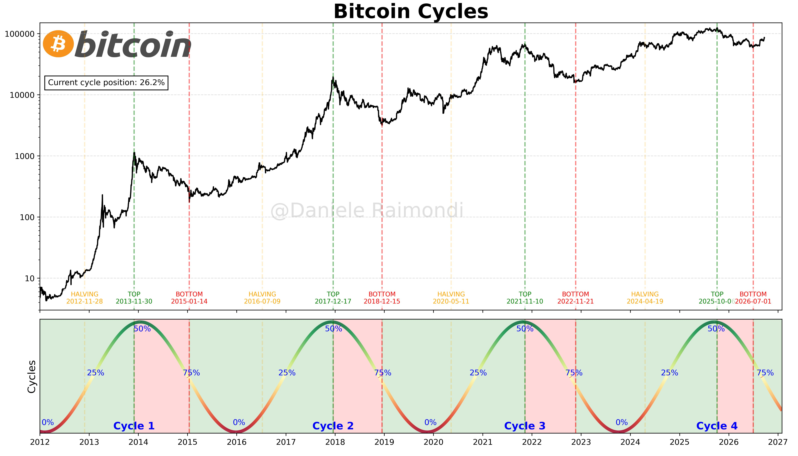
The Cycles project aims to analyze and visualize the cyclical patterns in Bitcoin's price movements, with a particular focus on the four-year cyclicity dictated by Bitcoin halving events. 
This approach provides insights into potential market trends and key turning points, highlighting how these critical halving milestones impact the broader cyclical behavior of Bitcoin's market value.

#### CyclesNorm 🔄 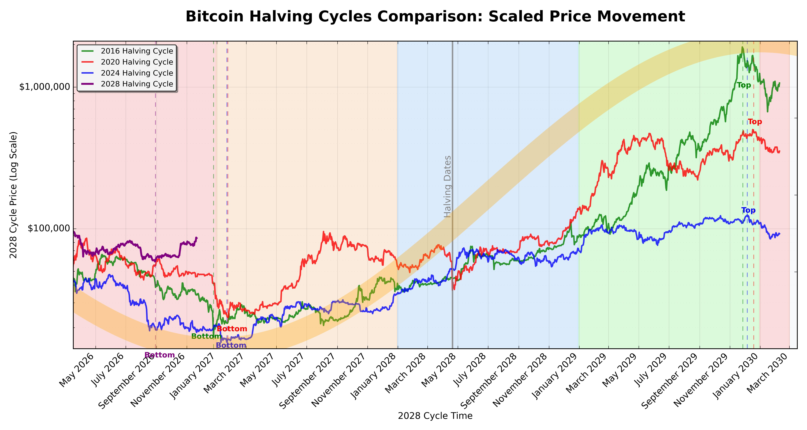
This analysis examines Bitcoin's price movements across multiple halving cycles, visualizing historical patterns and projecting potential future trends based on cycle alignment. By normalizing price data from the 2016, 2020, and 2024 halving cycles, the model enables direct comparison of market behavior across different periods, identifying key inflection points, and projecting the timing of potential tops and bottoms. The visualization includes color-coded background shading for different market phases and a sinusoidal overlay to represent the cyclical nature of Bitcoin price movements.

#### MVRV 🔋 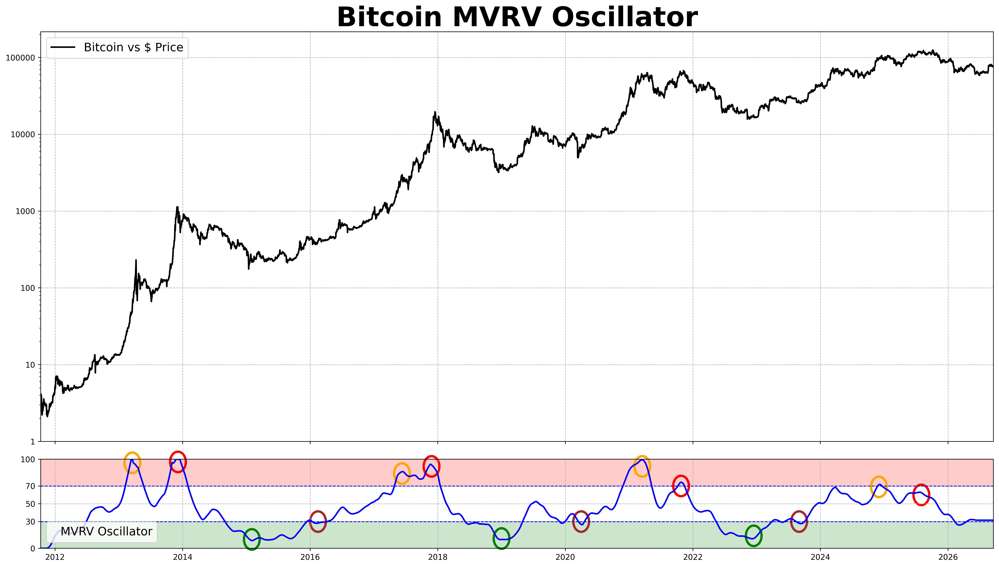
The MVRV project explores the relationship between Bitcoin's market and realized values by analyzing the MVRV ratio and price data to pinpoint market tops and bottoms. 
It introduces an oscillator for easy identification of overbought and oversold zones, highlighting the cyclical nature of Bitcoin with two peaks per cycle, where the second typically marks the ATH. 
This analysis aids in making informed investment decisions by understanding market trends and cycles.

#### Epochs Growth 📆 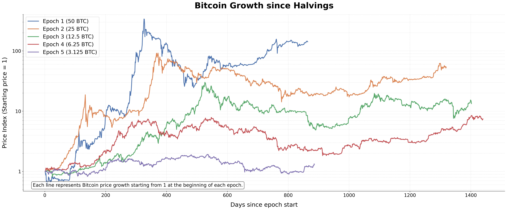
This section presents a visualization of Bitcoin's price growth since each halving event. It's useful to evaluate the diminishing returns effect over time.

## 3.Economics:

#### Economics 🪙 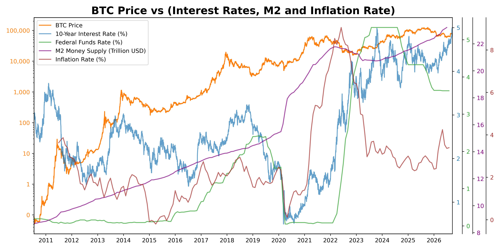
This chart helps analyze how U.S. macroeconomic indicators relate to Bitcoin's price by displaying them together on a single chart. This allows for easier understanding of their interactions and influences.

#### BTC vs Liquidity 🤑 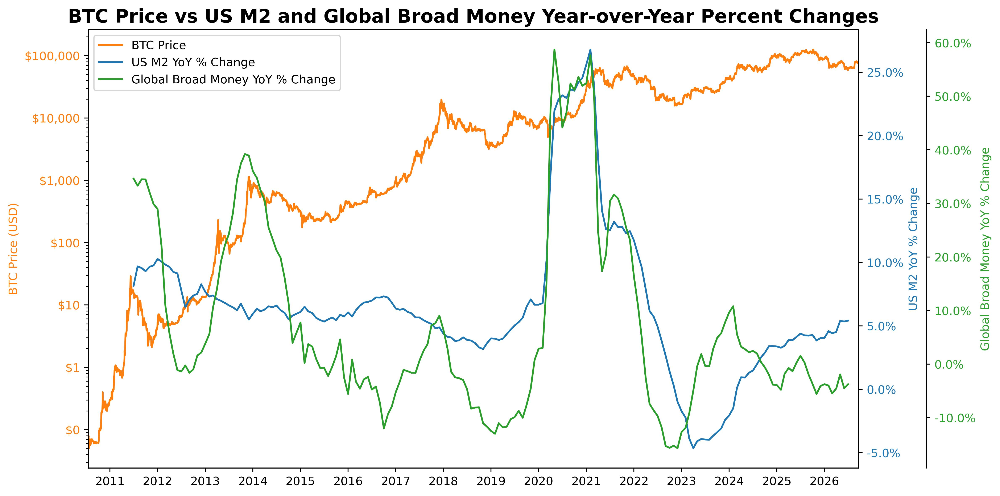
The plot illustrates the relationship between Bitcoin's price (BTC) and two important economic indicators:
The money supply shows a strong correlation with Bitcoin's price movements, highlighting how the increase in liquidity drives demand for Bitcoin as an asset.

#### DXY 💲 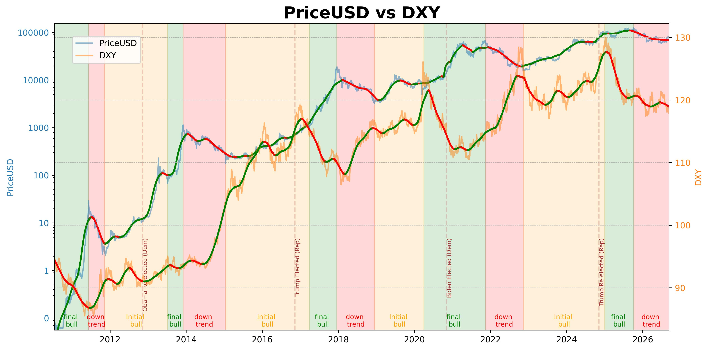
This study aims to analyze the relationship between Bitcoin prices (PriceUSD) and the US Dollar Index (DXY) over time. 
The hypothesis is that since BTC is backed by USD, it is significantly affected by the performance of DXY. 
I am using LOESS (Locally Estimated Scatterplot Smoothing) to visualize trends and their derivatives, providing insights into market behaviors during different periods.
Actually, as I expected, during the BTC depression phases, DXY is strong and growing. Instead, while BTC skyrockets, DXY is suffering and declining. It can be observed that, during the inbetween phases, DXY is stable.

## 4.Supply & Demand:

#### BTC vs M2 🕯 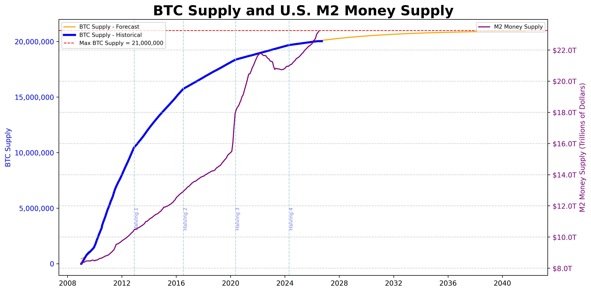
This section aims to compare Bitcoin's supply dynamics with the M2 money supply to highlight their fundamental differences in growth patterns, control mechanisms, and responses to economic conditions. The goal is to illustrate Bitcoin's potential as a stable store of value against the inflationary nature of traditional monetary systems.

#### Available Supply 💰 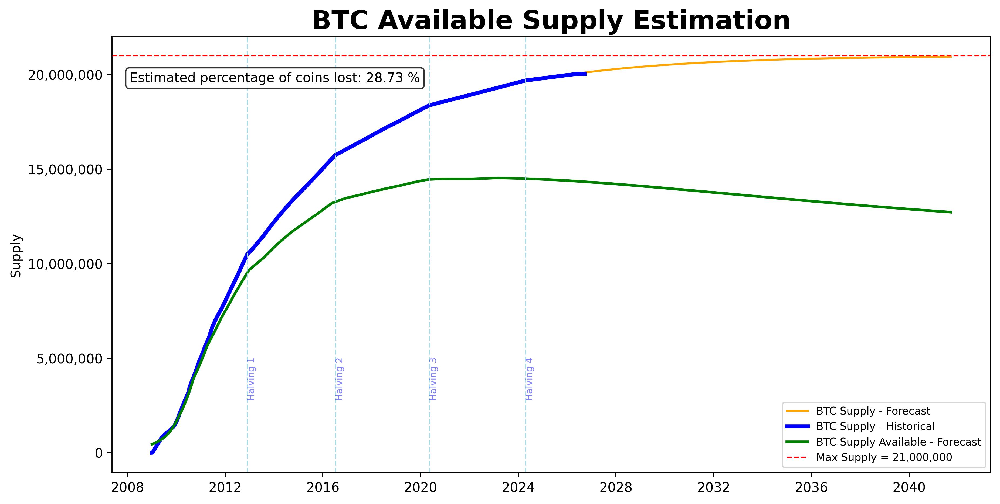
The project aims to estimate the percentage of Bitcoin that has been lost over time and predict the future available supply of Bitcoin, accounting for both the total supply limit and the estimated loss rate of coins. 
By modeling Bitcoin's supply growth and applying a decaying loss rate to simulate the reduction in lost coins over time, the project forecasts the effective supply available for circulation. 
This approach helps understand the dynamics affecting Bitcoin's scarcity and potential market impact, providing insights into how the diminishing supply and lost coins could influence Bitcoin's value in the long term.

#### Demand 🙋🏽‍♂️ 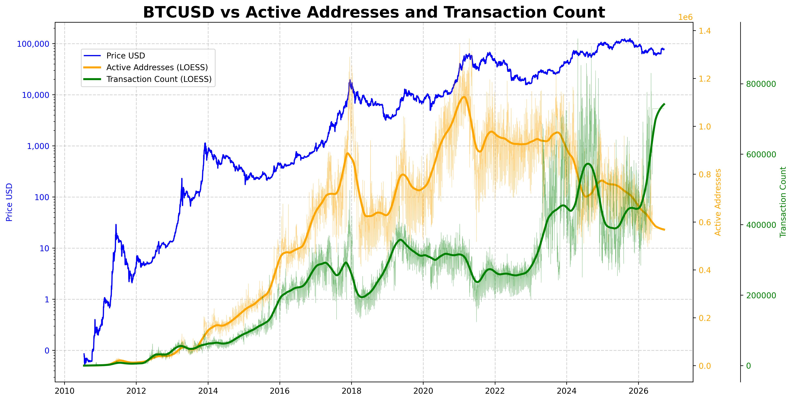
This study aims to analyze on-chain Bitcoin data to gain a deeper understanding of Bitcoin demand over time. By examining key metrics such as the number of active addresses and the total transaction count alongside Bitcoin's price, we can uncover valuable insights into market dynamics. These two metrics serve as proxies for estimating Bitcoin demand, showcasing a clear growth trend over time. As Bitcoin's adoption increases, these metrics provide a tangible measure of user engagement and transaction activity on the network.

## 5.Cohorts:

#### Cohorts 🐋 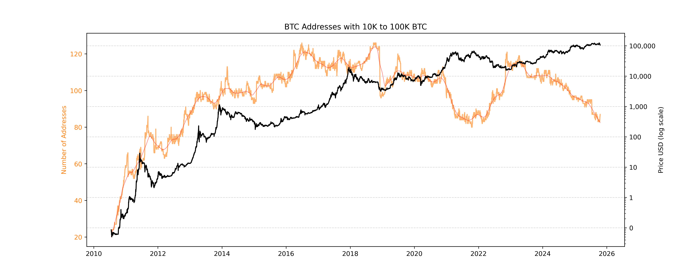
The project focuses on visualizing Bitcoin's distribution across address cohorts over time, highlighting balance ranges and applying LOESS smoothing to identify correlations with market behavior. 
By examining the reactions of different holder types to market changes, it reveals patterns of accumulation and distribution, offering insights into market sentiment and potential price trends.

## 6.Sentiment:

#### Google Trends 🔍 
The purpose of this study is to explore the correlation between Google search interest for specific cryptocurrencies and their price fluctuations over time. The hypothesis is that search trends might serve as a proxy for sentiment, potentially acting as an indicator of market behavior.

## 7.US Elections:

#### BTC vs US ELECTIONS 🇺🇸 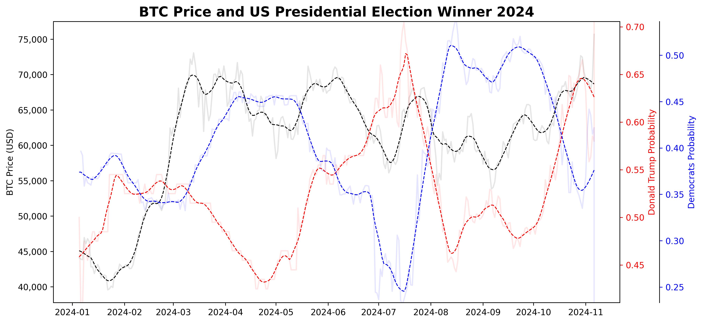
This analysis aims to explore the potential correlation between Bitcoin's price and Donald Trump's probability of winning the 2024 U.S. Presidential Election. The hypothesis is that political uncertainty, particularly the prospect of a Bitcoin-friendly president, may influence Bitcoin's value. By examining this relationship, we seek to determine whether election probabilities can serve as a predictive tool for Bitcoin price movements. Identifying a strong correlation could provide insights into forecasting Bitcoin's price based on political sentiment surrounding the election. Data for election probabilities are sourced from Polymarket.

#### Bitcoin Price Correlation with US Elections 🗳️ 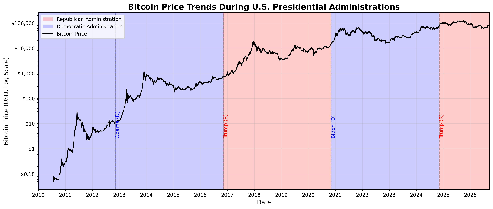
This analysis expands on my previous study by examining the broader relationship between Bitcoin price movements and significant political events globally. Beyond just the U.S. elections, we investigate how regulatory announcements, policy shifts, and major political transitions across different regions impact Bitcoin's volatility and overall trend. Through time-series analysis and correlation studies, we aim to identify patterns that might help predict how future political developments could influence the cryptocurrency market. This research provides investors with additional context for understanding Bitcoin's reaction to the geopolitical landscape.

## 8.ETF Flows:

#### ETF Flows distribution 🏦 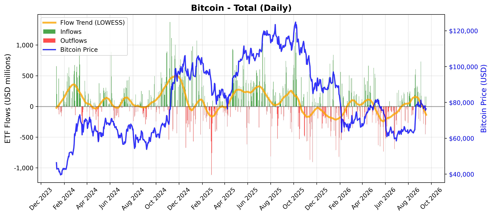
System that collects Bitcoin and Ethereum ETF flow data, integrates cryptocurrency prices, and generates visualizations with trend analysis.

## 9.Miners:

#### Correlations vs BTC + Holdings + Short Data ⛏️ 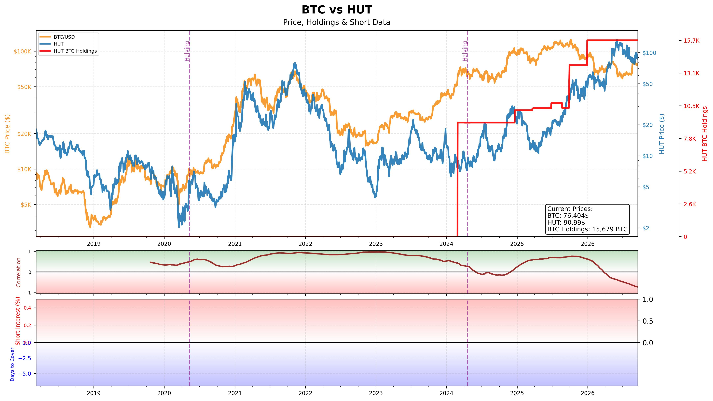
The objective of this analysis is to identify hedge and diversification opportunities in the crypto sector by studying correlations between Bitcoin and major mining companies while considering their BTC holdings and Short Data.

## 10.Valuation:

#### Puell Multiple ⛏️💵 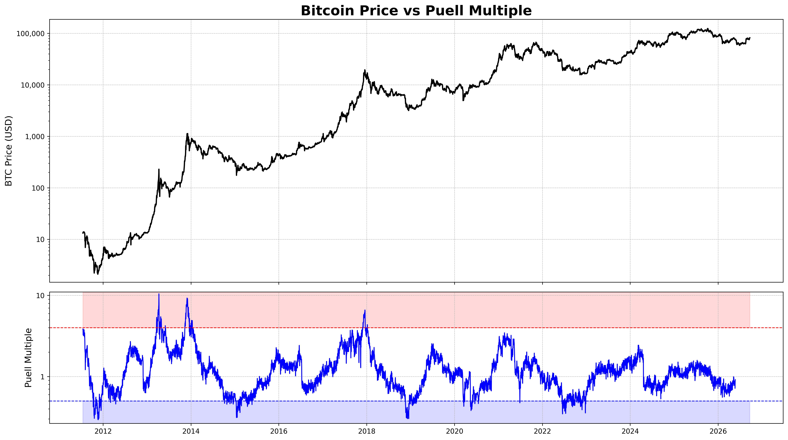
This chart compares the daily USD value of newly issued Bitcoin against its own 365-day moving average. Spikes above 4x have historically coincided with cycle tops (miners cashing out into euphoric prices), while drops below 0.5x have marked cycle bottoms (depressed miner revenue).

#### MVRV Z-Score 🧮 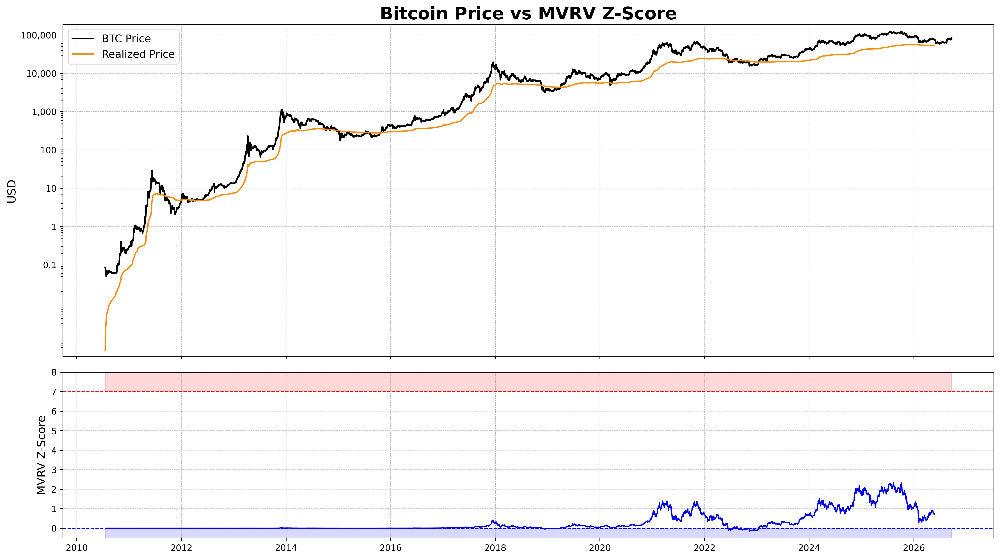
The MVRV Z-Score measures the gap between Bitcoin's market cap and its realized cap (the aggregate cost basis of all coins), normalized by the historical standard deviation of market cap. It plots the Realized Price alongside BTC price, and has historically flagged euphoric tops (Z-Score > 7) and capitulation bottoms (Z-Score < 0).

#### NUPL (Net Unrealized Profit/Loss) 😨🤑 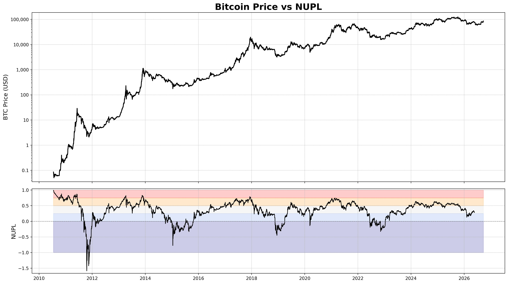
NUPL expresses the same market cap vs. realized cap gap as a fraction of market cap, split into five classic sentiment zones from Capitulation to Euphoria/Greed, offering a quick read on how much of the market is sitting on unrealized gains or losses.

#### Pi Cycle Top Indicator 🥧 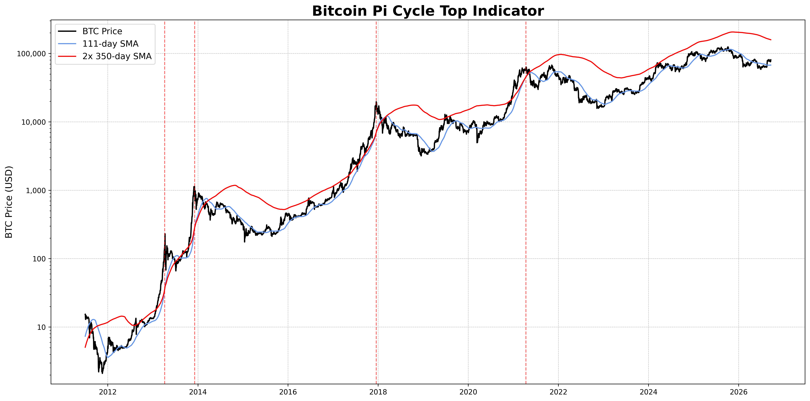
This indicator watches for the 111-day moving average crossing above 2x the 350-day moving average. Every time this crossover has occurred, Bitcoin's price has been within days of the cycle's eventual top.

#### Golden Ratio Multiplier 🌀 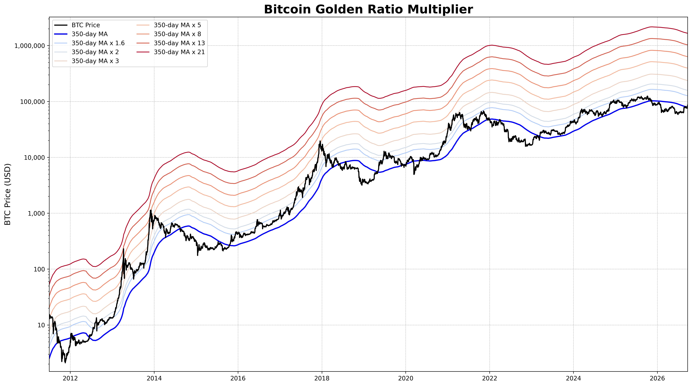
Tracks Bitcoin's 350-day moving average and its Fibonacci multiples (1.6x, 2x, 3x, 5x, 8x, 13x, 21x). Each band has historically lined up with a resistance level reached during past bull-market advances.

#### Hash Ribbons ⛏️📶 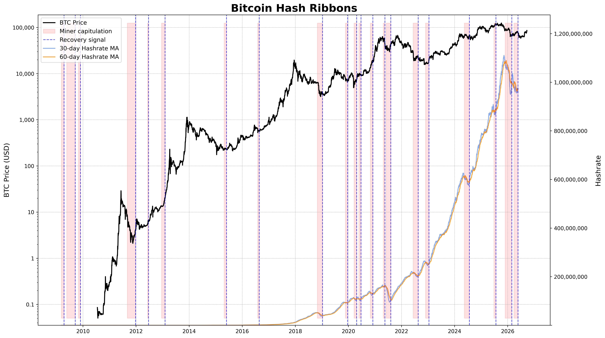
Compares the 30-day and 60-day moving averages of Bitcoin's hashrate to flag miner capitulation (30-day average below the 60-day) and its recovery. Historically, the recovery point has marked strong accumulation zones. Short whipsaws around the crossing point are filtered out so only sustained capitulations are flagged.

#### 2-Year MA Multiplier 📏 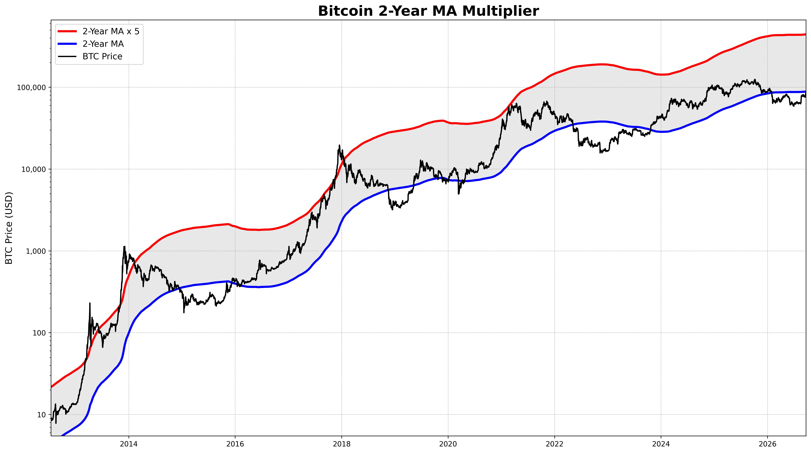
Plots Bitcoin's price against its own 730-day (2-year) moving average and 5x that average. The 2-year MA has historically acted as a strong long-term accumulation zone, while 5x the 2-year MA has capped the blow-off top of every cycle to date.

## 11.Risk Model:

#### Cycle Risk Model 🎚️ 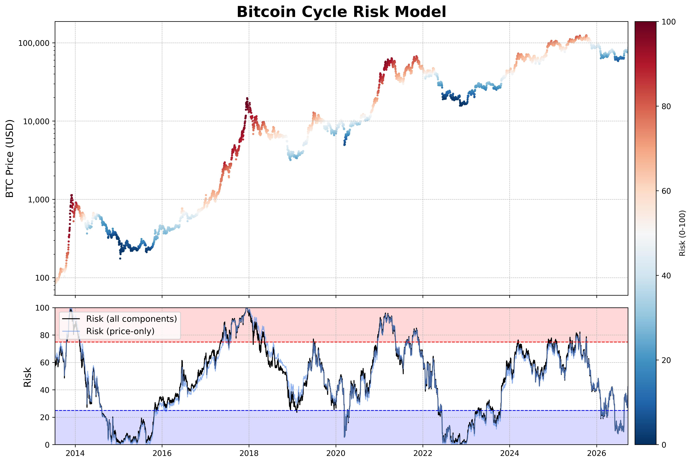
A single composite 0-100 score answering "where are we in the cycle?": 0 = cycle lows, 100 = cycle highs. It blends three indicators, each ranked against its own trailing 4-year distribution: the deviation of price from its expanding power-law trend (weight 0.6), the MVRV ratio (0.2) and the 2-Year MA Multiplier (0.2). Weights were selected by backtest rather than by taste, and are renormalized over whatever components are available so the score survives the on-chain feed lagging.

#### Validation ✅ 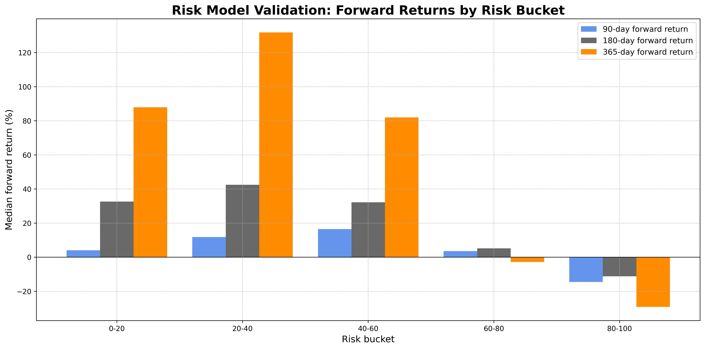
Forward returns by risk bucket at 90/180/365 days, plus Spearman rank correlations. Readings in the 80-100 bucket have historically been followed by *negative* median returns at every horizon (-14.5% at 90d, -29.1% at 365d), while low readings precede strong gains. The edge is concentrated at the extremes and grows with the horizon: this is a cycle-position tool, not a short-term timing signal.

#### Projection 🔮 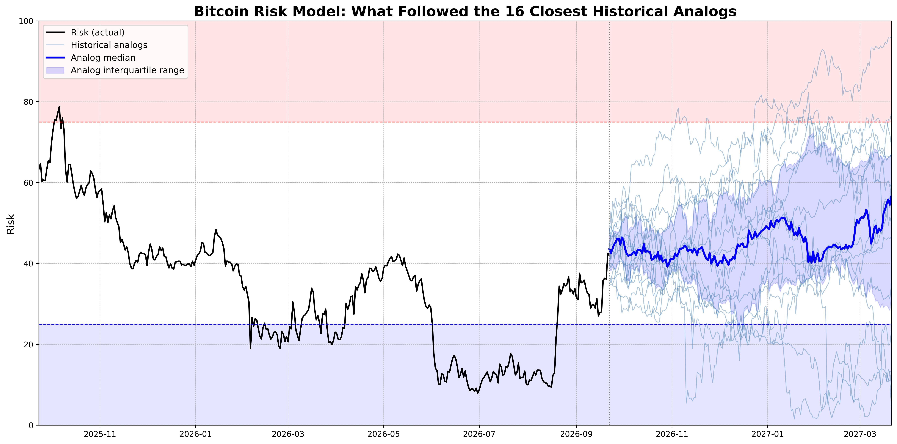
Rather than simulating random price paths (a block-bootstrap Monte Carlo was tried first and discarded: it ignores the mean reversion the score itself demonstrates and degenerates into a widening cone around today's value), the projection is conditional and empirical. It finds every past episode that started at today's risk level *and* today's 30-day direction of travel, then shows what the score actually did over the following 6 months in each, alongside the BTC return that came with it. Based on a handful of overlapping episodes from three completed cycles - read it as "what happened the last few times", not as a calibrated probability.

## Get Involved! 🌟

I believe in the power of community and collaboration. Here's how you can get involved:

- **Star this repo**: If you find this repository useful, give it a star! ⭐
- **Fork and Contribute**: Have ideas or improvements? Fork this repo and contribute your changes back via pull requests.
- **Feedback**: I love feedback! If you have suggestions or want to report issues, please open an issue in the repository.

## Stay Updated 📬

Bitcoin's market is volatile and endlessly fascinating. Stay ahead of the curve by keeping an eye on this repository as I regularly update my analyses and models with the latest data and techniques.

**Please note**, the content provided in this repository is for informational and educational purposes only and should not be construed as financial advice. Always conduct your own research and consult with a professional before making any investment decisions. 🚫💰📚

Happy exploring! 🕵️‍♂️🔍