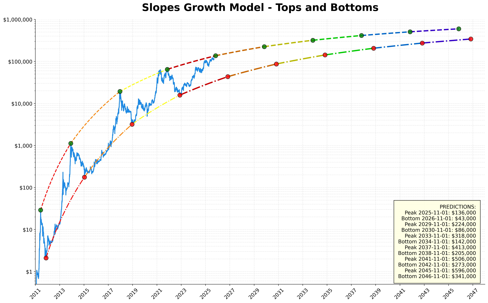
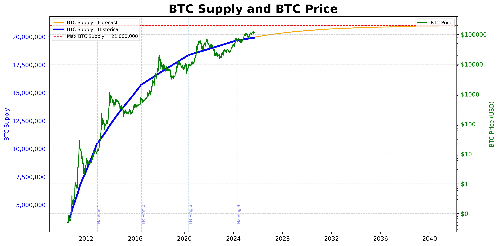
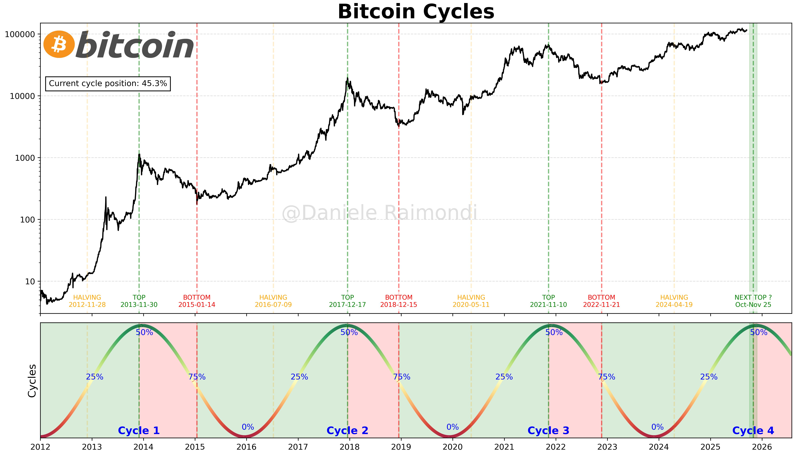
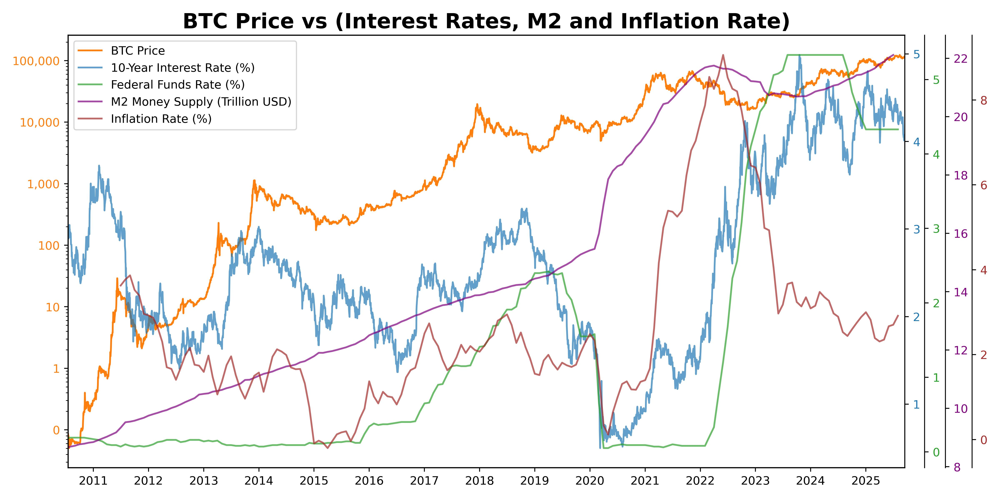
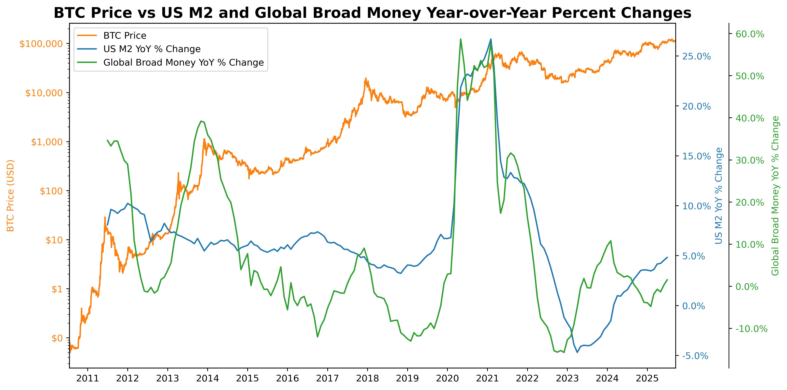

# **Bitcoin DataScience ₿** 📈

Welcome to `bitcoin_datascience`, your destination for exploring and modeling Bitcoin prices through the lens of data science! This repository is dedicated to providing insightful analysis, predictive models, and cutting-edge research on the ever-dynamic world of Bitcoin. Whether you're a seasoned trader, a crypto enthusiast, or a data science lover, you'll find valuable resources to deepen your understanding of Bitcoin's market movements and its underlying trends.

## What You'll Find Here 🧐

- **Jupyter Notebooks**: Dive into interactive analyses, from basic explorations to advanced predictive modeling, all designed to uncover hidden patterns and forecast future prices.
- **Python Code**: Access well-documented and reusable Python scripts and modules that power my analyses, making it easy for you to integrate and adapt them into your own projects.
- **Data Visualization**: Experience compelling visual narratives that bring data to life, offering clear and intuitive insights into Bitcoin's price behavior.
- **Machine Learning Models**: Explore sophisticated machine learning approaches to price prediction, from time series analysis to statistical modelling, all tailored towards the cryptocurrency market.

### Data are fetched at:

> BTC PRICE AND ON-CHAIN DATA: https://coinmetrics.io/community-network-data/

## List of projects: 📝

## 1.Growth:

#### ThermoModel 🌡️ 
The ThermoModel project aims to predict and analyze Bitcoin price movements by integrating cubic and logarithmic regression models. 
Through the creation of dynamic price bands and oscillators, it seeks to identify potential buy and sell zones, providing a comprehensive tool for understanding market trends and making informed investment decisions in the cryptocurrency space.

#### LogTimeLogPrice 🪜 
This study is a powerful tool designed to analyze Bitcoin's price growth over time using a log-log graph. In addition to plotting support and resistance lines using Ordinary Least Squares (OLS) regression, this function introduces an oscillator subplot. This oscillator provides insights into market sentiment, aiding investors in identifying potential buy and sell signals based on deviations from the trend lines.

#### AritmTimeLogPrice ⚙️ 
This section demonstrates an exponential transformation of the time dimension in the LogTimeLogPrice model. This transformation is applied to ensure the results are comparable with those of the ThermoModel.

#### ThermoLogTimeLogPrice 💪🏻 
Here I present a straightforward ensemble of the ThermoModel and LogTimeLogPrice models. The purpose is to average the predicted upper and lower bands from both models, providing a more robust forecast.

#### SlopesGrowthModel 🪴 
This analysis aims to estimate the future growth rate of Bitcoin's price by examining historical trends and projecting them into the future. The model is based on the observation that Bitcoin's growth rate, while still positive, has been decreasing over time. This decline is hypothesized to be related to Bitcoin halving events and the economic theory of diminishing returns.

#### BTCvsSupply 💭 
This analysis explores the growth correlation between Bitcoin's supply curve and its price history, to gain insights into how Bitcoin's programmed scarcity might influence its value over time.

#### BTC_SMA 💭 
In this visualization, we display the Bitcoin price movement in comparison to its Simple Moving Average (SMA) calculated over 209 weeks. The reason for choosing 209 weeks is linked to the Bitcoin halving cycle, which occurs every 4 years, approximately equivalent to 209 weeks. It has always been a great support of Bitcoin's prices.

## 2.Cycles:

#### Cycles 🧲 
The Cycles project aims to analyze and visualize the cyclical patterns in Bitcoin's price movements, with a particular focus on the four-year cyclicity dictated by Bitcoin halving events. 
This approach provides insights into potential market trends and key turning points, highlighting how these critical halving milestones impact the broader cyclical behavior of Bitcoin's market value.

#### MVRV 🔋 
The MVRV project explores the relationship between Bitcoin's market and realized values by analyzing the MVRV ratio and price data to pinpoint market tops and bottoms. 
It introduces an oscillator for easy identification of overbought and oversold zones, highlighting the cyclical nature of Bitcoin with two peaks per cycle, where the second typically marks the ATH. 
This analysis aids in making informed investment decisions by understanding market trends and cycles.

#### EpochsGrowth 📆 
This section presents a visualization of Bitcoin's price growth since each halving event. It's useful to evaluate the diminishing returns effect over time.

## 3.Economics:

#### Economics 🪙 
This chart helps analyze how U.S. macroeconomic indicators relate to Bitcoin's price by displaying them together on a single chart. This allows for easier understanding of their interactions and influences.

#### BTCvsLiquidity 🤑 
The plot illustrates the relationship between Bitcoin's price (BTC) and two important economic indicators:
The money supply shows a strong correlation with Bitcoin's price movements, highlighting how the increase in liquidity drives demand for Bitcoin as an asset.

#### DXY 💲 
This study aims to analyze the relationship between Bitcoin prices (PriceUSD) and the US Dollar Index (DXY) over time. 
The hypothesis is that since BTC is backed by USD, it is significantly affected by the performance of DXY. 
I am using LOESS (Locally Estimated Scatterplot Smoothing) to visualize trends and their derivatives, providing insights into market behaviors during different periods.
Actually, as I expected, during the BTC depression phases, DXY is strong and growing. Instead, while BTC skyrockets, DXY is suffering and declining. It can be observed that, during the inbetween phases, DXY is stable.

## 4.Supply & Demand:

#### BTCvsM2 🕯 
This section aims to compare Bitcoin's supply dynamics with the M2 money supply to highlight their fundamental differences in growth patterns, control mechanisms, and responses to economic conditions. The goal is to illustrate Bitcoin's potential as a stable store of value against the inflationary nature of traditional monetary systems.

#### AvailableSupply 💰 
The project aims to estimate the percentage of Bitcoin that has been lost over time and predict the future available supply of Bitcoin, accounting for both the total supply limit and the estimated loss rate of coins. 
By modeling Bitcoin's supply growth and applying a decaying loss rate to simulate the reduction in lost coins over time, the project forecasts the effective supply available for circulation. 
This approach helps understand the dynamics affecting Bitcoin's scarcity and potential market impact, providing insights into how the diminishing supply and lost coins could influence Bitcoin's value in the long term.

#### Demand 🙋🏽‍♂️ 
This study aims to analyze on-chain Bitcoin data to gain a deeper understanding of Bitcoin demand over time. By examining key metrics such as the number of active addresses and the total transaction count alongside Bitcoin's price, we can uncover valuable insights into market dynamics. These two metrics serve as proxies for estimating Bitcoin demand, showcasing a clear growth trend over time. As Bitcoin's adoption increases, these metrics provide a tangible measure of user engagement and transaction activity on the network.

## 5.Cohorts:

#### Cohorts 🐋 
The project focuses on visualizing Bitcoin's distribution across address cohorts over time, highlighting balance ranges and applying LOESS smoothing to identify correlations with market behavior. 
By examining the reactions of different holder types to market changes, it reveals patterns of accumulation and distribution, offering insights into market sentiment and potential price trends.

## Get Involved! 🌟

I believe in the power of community and collaboration. Here's how you can get involved:

- **Star this repo**: If you find this repository useful, give it a star! ⭐
- **Fork and Contribute**: Have ideas or improvements? Fork this repo and contribute your changes back via pull requests.
- **Feedback**: I love feedback! If you have suggestions or want to report issues, please open an issue in the repository.

## Stay Updated 📬

Bitcoin's market is volatile and endlessly fascinating. Stay ahead of the curve by keeping an eye on this repository as I regularly update my analyses and models with the latest data and techniques.

**Please note**, the content provided in this repository is for informational and educational purposes only and should not be construed as financial advice. Always conduct your own research and consult with a professional before making any investment decisions. 🚫💰📚

Happy exploring! 🕵️‍♂️🔍